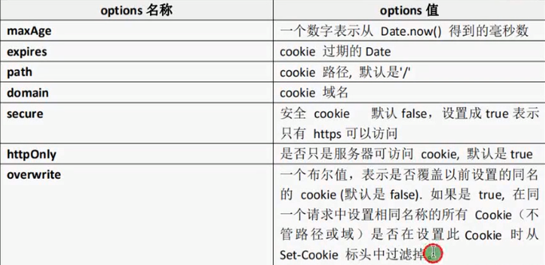

# Koa

​	**Koa，基于Node.js平台的下一代web开发框架**

​	Koa 是一个新的 web 框架，由 Express 幕后的原班人马打造， 致力于成为 web 应用和 API 开发领域中的一个更小、更富有表现力、更健壮的基石。 通过利用 async 函数，Koa 帮你丢弃回调函数，并有力地增强错误处理。 Koa 并没有捆绑任何中间件， 而是提供了一套优雅的方法，帮助您快速而愉快地编写服务端应用程序。**开发思路与express差不多，最大的特点就是可以避免异步嵌套** 。

​	阿里基于koa开发了**egg**

## 安装

Koa 依赖 **node v7.6.0** 或 ES2015及更高版本和 async 方法支持. 

```shell
$ nvm install 10
$ npm init --yes
$ npm i koa --save
```

## 简单使用

```js
const koa = require("koa");

var app = new koa();

//配置路由
//中间件
//express写法
// app.use(function(req,res){
// 	res.end(".....");
// });

app.use(async(ctx) => {
	ctx.body = 'hello koa';
});

app.listen(8080);
```

## 路由

​	**路由（Routing）是由一个URI（或者叫路径）和一个特定的HTTP方法组成的**，涉及到应用如何响应客户端对某个网站节点的访问。

​	**路由就是根据不同的URL地址加载不同的页面实现不同的功能**。

koa需要单独安装**koa-router**

```shell
$ npm i koa-router --save
```

### 使用

```js
const Koa = require("koa");
const Router = require("koa-router");
//var router = require("koa-router")();	直接实例化

var app = new Koa();
var router = new Router();

//配置路由
router.get('',function(ctx){
	ctx.body = 'router body';
}).get('/new',async (ctx)=>{
	ctx.body = "new body";
});

//启动路由
app.use(router.routes())	//启动路由
   .use(router.allowedMethods());	//在所有路由中间件最后调用，根据ctx.status设置response响应头

app.listen(8080);
```

### Get传值

```js
	//获取get传值	
	console.log(ctx.query); // { id: '111', name: 'lov' }
	console.log(ctx.querystring); // id=111&name=lov
	console.log(ctx.url); //  /new?id=111&name=lov
	console.log(ctx.request.url); //  /new?id=111&name=lov
	console.log(ctx.request.query);// { id: '111', name: 'lov' }
	console.log(ctx.request.querystring); // id=111&name=lov
```

### 动态路由

```js
//'/newscontent/:id/:name'	可以设置传入多个值

router.get('/newscontent/:id',function(ctx){
	//动态路由
	//http://localhost:8080/newscontent/111
	console.log(ctx.params);	// { id: '111' }

	ctx.body = 'newscontent body';
});

```

## 中间件

​	中间件就是匹配路由之前或匹配路由完成做的一系列的操作

​	在express中，中间件（middleware）是一个函数，可以访问请求对象，响应对象，和web应用中处理请求-响应循环流程中的中间件。一般被命名为next变量。在koa中中间件与express有点类似。

### 中间件的功能

​	执行任何代码

​	修改请求 和响应对象

​	终结请求-响应循环

​	调用堆栈中的下一个中间件

如果get、post回调函数中，没有next参数，那么就匹配第一个路由，就不会往下匹配。如需往下匹配，需要写next()

### koa应用可使用的中间件

#### 应用级中间件

```js
//应用级中间件，无论在哪里，都会先执行该中间件
app.use(async (ctx,next)=>{	//不加路径参数，默认对所有路径使用
	console.log(new Date());
	await next();
});
```

#### 路由级中间件

```js
router.get('/log',function(ctx,next){
	console.log('log  middleware');

	next();
});

router.get('/log',function(ctx){
	ctx.body = 'router body';
});
```

#### 错误处理中间件

```js
app.use(async (ctx,next)=>{	
	console.log(new Date());
	await next();//执行路径路由匹配

	//通过上面的next，先进行路径的路由匹配，再执行以下逻辑
	if(ctx.status == 404){
		ctx.body = "404 PAGE";
	}else {
		console.log(ctx.url);
	}

});
```

#### 第三方中间件

##### ejs模板引擎

```shell
$ npm i koa-views --save 
$ npm i ejs --save
```

```js
// ejs模板引擎使用
const Koa = require("koa"),
	  router = require("koa-router")(),
	  views = require("koa-views");//1、引入views

var app = new Koa();

//2、配置模板引擎中间件（第三方中间件）
//app.use(views('views',{map: {html: 'ejs'}}))	//该方式配置时，模板后缀名为html
app.use(views('views',{
	extension: 'ejs'	//应用ejs模板引擎
}));

//ctx.state中的值在ejs模板中可以直接使用，该方式必须写在中间件中
app.use(async (ctx,next)=>{
	ctx.state.userinfo = 'userinfo-lov';
	await next();//koa中必须使用await
});

app.use(async (ctx,next)=>{	
	console.log(new Date());
	await next();

	if(ctx.status == 404){
		ctx.body = "404 PAGE";
	}else {
		console.log(ctx.url);
	}

});


router.get('/',async function(ctx){

	let title = "Hello ejs";
	let list = ['aaa','bbb','ccc'];
	let content = "<h2>content</h2>";
	let num = 20;
	//传值
	// 3、必须使用await，否则为异步执行，会导致找不到路由
	await ctx.render('index',{
		title: title,
		list: list,
		content: content,
		num: num
	});
	// ctx.body = 'router body';
}).get('/news',async (ctx)=>{
	
	ctx.body = "news body";

}).get('/newscontent/:id',function(ctx){
	console.log(ctx.params);	// { id: '111' }

	ctx.body = 'newscontent body';
});

router.get('/log',function(ctx,next){
	console.log('log  middleware');

	next();
});

router.get('/log',function(ctx){
	ctx.body = 'router body';
});

app.use(router.routes())	
   .use(router.allowedMethods());	

app.listen(8080);
```

## POST提交数据

### 原生

```js
1、
exports.getPostData = function(ctx){
	// 获取数据 异步
	return new Promise((resolve,reject)=>{
		try{
			let str = '';
			ctx.req.on('data',function(data){
				str+= data;
			})

			ctx.req.on('end',function(data){
				resolve(str);
			})
		}catch(err){
			reject(err);
		}
	});
}
---------------------------------------------
	2、common = require('./module/common.js');
..........
	3、
	var data = await common.getPostData(ctx);	//原生
	console.log(data);
	ctx.body = data;
//username=lov&password=123
```

### koa-bodyparser

```js
1、bodyparser = require("koa-bodyparser")

2、//使用bodyparser中间件
app.use(bodyparser());

3、router.post('/doadd',async (ctx)=>{
	ctx.body = ctx.request.body;
})
//{"username":"lov","password":"123"}
```

## Static静态资源

```js
1、static = require("koa-static");

2、//静态web服务中间件
//可配置多个
//先去static目录中找，如果能找到就返回对应的文件，否则执行next()
app.use(static('./static'));

app.use(static('./public'));
```

```html
	<link rel="stylesheet" type="text/css" href="css/main.css">

	
```

## art_template模板引擎

​	art-template是一个简约、超快的模板引擎。

​	采用作用域预声明的技术来优化模板渲染速度，从而获取接近javascript极限的运行性能，并且同时支持NodeJS和浏览器。

​	art-template支持ejs的语法，也可以用类似angular数据绑定的语法。

​	https://aui.github.io/art-template/docs/

```shell
$ npm i art-template --save
$ npm i koa-art-template --save
```

```js
const Koa = require("koa"),
	  router = require("koa-router")(),
     //1、引入koa-art-template与path
	  render = require("koa-art-template"),
	  path = require('path');//引入path

var app = new Koa();

//2、配置koa-art-template模板引擎
render(app,{
	root: path.join(__dirname,'views'),	//视图的位置
	extname: '.html',	//后缀名
	debug: process.env.NODE_ENV !== 'production' //是否开启调试模式
})

router.get('',async (ctx)=>{
	// ctx.body ="Home Page";
	let list = {
		name: 'lov',
		h3: '<h3>content</h3>',
		num: 20,
		arr: ['aaa','bbb','ccc','ddd']
	}
    //3、
	await ctx.render('index',{
		list: list
	});
});

router.get('/news',async (ctx)=>{
	ctx.body = "News Page";
});

app.use(router.routes());
app.use(router.allowedMethods());

app.listen(8080);
```

## Cookie

**Koa中设置Cookie的值**

`ctx.cookies.set(name,value,[options])`

通过设置options设置cookie name 的value：



**Koa中获取Cookie的值**

`ctx.cookies.get(name)`

```js
ctx.cookies.set('userinfo','lov',{
		maxAge: 60*1000*60
	});
//-------------------------------------------
let userinfo = ctx.cookies.get('userinfo');
	console.log(userinfo);
```

**对于中文**

```js
//设置中文转换
	let name = Buffer.from('张三').toString('base64');
	ctx.cookies.set('name',name,{
		maxAge: 60*1000*60
	});
//--------------------------------------------]
//获取中文转换
	let data = ctx.cookies.get('name');
	let name = Buffer.from(data,'base64').toString();
	console.log(name);
```

## Seesion

```shell
$ nppm i koa-seesion --save
```

```js

```


## mongodb

## 路由模块化

## 路由视图模块化

